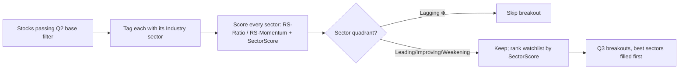
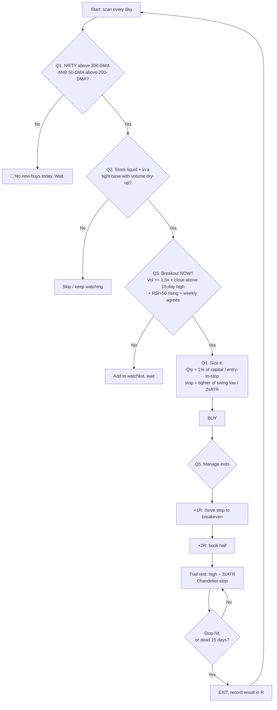

# Robust Swing v1 — The Complete Strategy, Explained Simply

> **Who is this for?** You. Even if you have *never* traded before. I will explain
> everything from zero, with everyday examples, and always tell you the **why**
> behind each rule — not just the *what*.
>
> **Reading tip:** Read Parts 1–4 slowly (the ideas). Parts 5–9 are the actual
> rules. Parts 10–14 are the "putting it together + build" details.

---

## Table of Contents

1. [What are we even doing? (the basics)](#part-1--what-are-we-even-doing)
2. [The one big idea](#part-2--the-one-big-idea)
3. [Our tools (indicators explained like you're 10)](#part-3--our-tools)
4. [The 5 questions every trade must answer](#part-4--the-5-questions)
5. [Q1: Is the whole market healthy? (Regime filter)](#part-5--q1-is-the-market-healthy)
6. [Q2: Is THIS a good stock? (Universe + base)](#part-6--q2-is-this-a-good-stock)
   - [Q2.5: Is the sector in season? (Sector rotation)](#part-65--q25-is-the-sector-in-season-sector-rotation)
7. [Q3: Is it waking up NOW? (Entry trigger)](#part-7--q3-is-it-waking-up-now)
8. [Q4: How much do I buy? (Position sizing)](#part-8--q4-how-much-do-i-buy)
9. [Q5: When do I get out? (The exit ladder)](#part-9--q5-when-do-i-get-out)
10. [The full picture (flowchart + a story)](#part-10--the-full-picture)
11. [What to honestly expect](#part-11--what-to-honestly-expect)
12. [How we build it](#part-12--how-we-build-it)
13. [Glossary](#part-13--glossary)
14. [All the settings in one table](#part-14--all-settings-in-one-place)

---

## Part 1 — What are we even doing?

### What is a stock?

A **stock** (or "share") is a tiny slice of ownership in a company. If a company
is a giant pizza, one share is one slice. If the company does well, your slice
becomes worth more. You can buy a slice today and sell it later for a higher (or
lower) price.

### What is "swing trading"?

There are three common ways people trade. Think of a long train journey:

| Style | Train analogy | Holding time |
|---|---|---|
| **Investing** (buy & hold) | Ride the train from the first station to the last | Years |
| **Swing trading** ← *this doc* | Get on, ride for **a few stations**, get off | **A few days to a few weeks** |
| **Day trading** | Jump on and off at every single stop | Minutes to hours |

**Swing trading = catch one clean "up-move" (a swing) that lasts a few days to a
few weeks, then get off.** We're not trying to catch the whole journey, and we're
not jumping around all day.

### What does a swing trade look like?

A stock price never goes straight up. It moves in waves — up a bit, rest, up
again. We try to buy just as a new up-wave *starts*, ride it, and sell before it
tires out.

```
 Price
   ^
   |                              ___  ← we SELL here (wave tiring)
   |                         ____/
   |                    ____/         ← we RIDE the wave up
   |               ____/
   |    BUY here → /
   |   ___________/   ← stock was quiet & resting ("base")
   |  /
   +----------------------------------------> Time
```

That's the whole game: **buy as the spring uncoils, ride, get off before it
runs out of energy.** Everything below is just *how to do that safely and
repeatably*.

---

## Part 2 — The one big idea

Here is the single most important idea in this entire document:

> **Big up-moves usually start after a boring, quiet period — not out of the blue.**

Think of a runner about to do a long jump. They don't jump from a standing
position. They **crouch down first** (gather energy), then explode upward. The
tighter and more patient the crouch, the bigger the jump.

Stocks do the same thing. This "crouch" is called a **base** (or
"consolidation"). During a base:

- The price stops going down and moves **sideways** in a narrow range.
- Trading **volume dries up** (fewer people buying/selling — everyone's waiting).
- The stock looks *boring*. Most people ignore it. **That's exactly when we
  start watching it.**

Then one day, **volume explodes** and the price **breaks out** above the top of
the base. That's the spring uncoiling — the start of a new up-wave.

```
                              🚀  BREAKOUT!  (big volume, price jumps out)
                             /
   ceiling of the base  ────/──────────────  ← "15-day high" (the lid)
   ┌───────────────────────┐
   │  quiet sideways base   │ ← price rests here for days/weeks
   │  (the "crouch")        │    volume is LOW here
   └───────────────────────┘
        ↓ came down first, then went quiet
```

**Our whole strategy is built to find these crouches and buy the jump — while
protecting ourselves when the jump fails** (because sometimes it does).

---

## Part 3 — Our tools

We use a few simple measuring tools called **indicators**. An indicator is just a
number calculated from price or volume that tells us *one specific thing*. Here
are the only ones we need — each explained with an everyday example.

### 3.1 Candles (how we read price)

Each day, a stock has an open, high, low, and close price. We draw this as a
**candle**. A green candle = price went **up** that day. Red = went **down**.
The thin lines ("wicks") show the highest and lowest points touched.

```
   │  ← high (wick)
  ┌┴┐
  │ │ ← green body: opened low, closed high (up day)
  └┬┘
   │  ← low (wick)
```

You don't need to master candles — just know green = up day, red = down day.

### 3.2 Moving Average (MA) — "your average marks"

Imagine your test scores bounce around: 60, 90, 40, 85… hard to see if you're
improving. So you take the **average of your last 50 tests**. That smooth
average shows your *real* trend, ignoring one lucky or unlucky day.

A **Moving Average** does exactly this for price: it's the average closing price
over the last N days. We use:

- **50-day MA** = the stock's medium-term mood.
- **200-day MA** = the stock's (or market's) long-term mood.

**Why it matters:** if today's price is *above* its 200-day average, the trend is
healthy. Below it = something's wrong. Simple and powerful.

### 3.3 The 200-DMA of the *whole market* — "the mood of the school"

Here's a subtle but huge idea. Imagine your whole school is in a **sad mood**
(exams went badly for everyone). Would you throw a big party? No — even a good
reason to celebrate falls flat when the whole room is down.

The stock market is the same. When the **overall market** (the NIFTY index) is
weak, even good stocks with perfect setups tend to fail. So before ANY trade, we
check: **is the whole market above its 200-day average?** That's the school's
mood. 🟢 Good mood → we trade. 🔴 Bad mood → we wait.

### 3.4 RSI — "how tired is the runner?"

**RSI** (Relative Strength Index) is a number from 0 to 100 that measures
momentum — basically, *how hard and how recently has the price been pushing?*

- RSI near **50** = neutral, balanced.
- RSI **above 50 and rising** = buyers are in control (fresh energy). 👍
- RSI very high (**above 80**) = the runner has been sprinting hard — *might* be
  getting tired (but see the warning below).

> ⚠️ **Common mistake we avoid:** many beginners sell the moment RSI hits 70 or
> 80 ("overbought!"). But in a strong up-move, **a tired-looking runner can keep
> running for a long time**. Selling just because RSI is high makes you dump your
> best trades too early. We do **not** use "RSI is high" as a sell signal.

### 3.5 ATR — "how bouncy is this ball?"

**ATR** (Average True Range) measures how much a stock *typically* moves in a day
— its bounciness.

- A calm stock might move ₹5/day → small ATR.
- A wild stock might move ₹50/day → big ATR.

**Why it matters:** a super-bouncy ball needs more room to bounce, or you'll
"lose" it. A wild stock needs a **wider stop-loss** so normal daily bouncing
doesn't kick us out. ATR lets us set stops that fit *each* stock's personality
instead of using one dumb fixed number for everyone. We'll use this a lot in
Parts 8 and 9.

### 3.6 Volume — "how many people are cheering?"

**Volume** = how many shares traded that day = how many people are participating.

- A price breakout on **low** volume = a few kids clapping. Probably fake. 👎
- A price breakout on **huge** volume = the whole crowd roaring. Real move. 👍

**Why it matters:** volume is the *proof* behind a price move. This is the one
dimension the popular "SuperTrend + RSI" strategies ignore — and it's the
backbone of ours.

---

## Part 4 — The 5 questions

Every single trade we take must answer **five questions, in order**. If any
answer is "no," we do nothing and wait. This is the entire strategy in one frame:

```
  ┌─────────────────────────────────────────────────────────┐
  │  Q1. Is the whole MARKET healthy?      → if no, STOP     │
  │  Q2. Is THIS stock a good candidate?   → if no, SKIP     │
  │  Q3. Is it waking up RIGHT NOW?        → if no, WAIT     │
  │  Q4. How MUCH do I buy?                → math decides    │
  │  Q5. When do I GET OUT?                → planned before  │
  └─────────────────────────────────────────────────────────┘
```

Notice the shape: **three filters that mostly say "no," then two rules that
manage money and risk.** Great trading is mostly *saying no* and *sizing right* —
not finding magic buy signals. Let's go deep on each.

---

## Part 5 — Q1: Is the market healthy?

### The idea: the tide lifts (or sinks) all boats

You can be the best sailor with the best boat, but if the **tide** is going out,
you're fighting the ocean. In the market, the "tide" is the overall index
(NIFTY). **~3 out of 4 stocks move in the same direction as the market.** So
trading against the market tide is fighting bad odds for no reason.

### The rule

> **Only take new buy trades when NIFTY is ABOVE its 200-day moving average,
> AND its 50-day MA is above its 200-day MA.**

```
  NIFTY price ABOVE its 200-day average   →  🟢  GREEN LIGHT — hunt for trades
  NIFTY price BELOW its 200-day average   →  🔴  RED LIGHT   — no new buys, wait
```

### Why *two* conditions (200-DMA and 50 > 200)?

- **Price above 200-DMA** = "the market is in a long-term uptrend right now."
- **50-DMA above 200-DMA** = "the uptrend is *established*, not a one-day fluke."

Together they mean: *the tide is genuinely coming in.* This single filter
removes most of the big, painful losing streaks — because it stops us from buying
breakouts during market crashes, when almost everything fails no matter how good
it looks.

### Why this is the highest-value rule in the whole doc

Most beginner strategies obsess over the perfect *buy signal* on a single stock
and completely ignore the market. But research and hard experience both say the
same thing: **the market's regime matters more than any single stock's chart.**
Get this one right and you've already beaten most retail traders.

---

## Part 6 — Q2: Is this a good stock?

Now that the market is healthy, we look for stocks in that "crouch before the
jump" state. This is your existing **Siva** logic — it's genuinely good, and we
keep it. It has two checks: *can we even trade it* (liquidity), and *is it
building a base* (the setup).

### 6.1 Liquidity — "can I get in and out easily?"

Imagine trying to sell a rare toy: if only 2 people in the world want it, you're
stuck. But a popular toy sells instantly. Stocks are the same. We only trade
stocks where **lots of shares change hands daily**, so we can enter and exit at
fair prices.

> **Rule:** average daily traded value over 20 days **> ₹5 crore** (or avg volume
> > 2,00,000 shares), and price **> ₹80**.

**Why:** thin, cheap stocks have wild, unfair prices and are easy to manipulate.
We avoid them entirely.

### 6.2 The base — "the crouch before the jump"

We want a stock that (a) fell and cooled off, (b) then went quiet and sideways,
(c) with volume drying up. Three sub-checks:

**(a) Momentum reset** — the stock cooled down from being hot.
> RSI averaged over the last 25 days sits in a **calm 35–48 range**, and at some
> point dipped below 35.

*Why:* we want sellers to be **exhausted**. A stock that already fell and went
quiet has "shaken out" the nervous holders. Fresh buyers now have room to push
it up. Buying something already screaming higher = buying when it's expensive and
tired.

**(b) Base formation** — price went sideways in a tight range.
> Over the last 20 days, (highest high − lowest low) / lowest low **< 20%**.

*Why:* a **tight** base is a tightly coiled spring. The narrower the crouch, the
more explosive the jump, and the *closer* our safety-stop can sit (small risk).

**(c) Volume dry-up** — everyone stopped paying attention.
> Average volume of last 10 days **<** average volume of last 30 days.

*Why:* falling volume during the base means **selling has stopped** (no one left
who wants out). It's the calm before the storm. When volume then suddenly
returns, that's our signal (Q3).

```
   Price          (b) tight sideways base          🚀 (breakout comes in Q3)
     |          ┌───────────────────────┐         /
     |   \      │                        │        /
     |    \____ │  20-day range < 20%    │───────/
     |         \│________________________│
     |          ↑ (a) fell & RSI reset      
     |                                        
   Volume   ████ big          ▂▂▁▁▁ (c) volume drying up      ████ returns!
     |      ████                ▂▂▁▁▁                          ████
     +----------------------------------------------------------------→ Time
```

Stocks that pass Q2 go on a **watchlist**. They are *candidates*, not buys yet.
We wait for them to actually wake up. But before we do — one more question makes
the watchlist *much* smarter. Which stocks should we prefer? The ones in a hot
sector. That's Part 6.5.

---

## Part 6.5 — Q2.5: Is the sector in season? (Sector rotation)

> **New in v1.1.** This is a *preference* layer, not a new hard gate. It sits
> between "is this a good stock?" (Q2) and "is it breaking out?" (Q3). It doesn't
> replace any rule — it just tells us **which** of our valid setups deserve our
> limited money first.

### The idea: half a stock's move is really its sector's move

Think of a harbour full of boats. Q1 asked "is the tide coming in?" (the whole
market). But the harbour also has **currents** — some lanes are flowing fast, some
are dead calm. A boat in a fast-flowing lane gets carried along; the same boat in
a dead lane has to row every inch itself.

Sectors are those currents. Money in the market doesn't rise evenly — it **rotates**.
For a few months everyone piles into IT, then it cools and the money floods into
Banks, then Auto, then Pharma, and so on. At any moment, a handful of sectors are
**"in season"** (money flowing in, prices leading) and a handful are **"out of
season"** (money leaving, prices lagging).

> **Roughly half of a stock's move comes from its sector.** A perfect base-breakout
> in a *leading* sector has the wind at its back. The exact same chart in a *lagging*
> sector is rowing against the current — same setup, far worse odds.

So: given ten stocks that all passed Q2, we want to **spend our 6 position slots on
the ones sitting in the fast lanes.**

### Two ways to pick the fast lanes (and which we use)

There are two classic schools of sector rotation:

1. **The economic-cycle model** — a textbook map that says "early recovery →
   financials & industrials lead; late cycle → energy & materials; slowdown →
   staples & healthcare," and so on. *Why we don't lean on this:* it requires us to
   correctly **forecast the macro economy**, which is exactly the kind of guessing
   this whole strategy avoids. We don't predict; we **measure**.

2. **The price-momentum model (what we use)** — forget forecasting. Just *measure*
   which sectors are actually outperforming the market **right now** and follow
   them. The market has already voted with real money. This is the same
   "follow strength, don't predict" philosophy behind every other rule in this doc.

We implement the momentum model with a well-known visualization called the
**Relative Rotation Graph (RRG)**, created by Julius de Kempenaer. It answers two
questions about each sector at once:

- **Is it strong vs. the market?** (leading or lagging)
- **Is that strength growing or fading?** (momentum)

### The RRG: four "seasons" for every sector

We plot every sector on a simple 2-axis map. Both axes are centred on **100** (=
"exactly average, same as the market"):

- **Horizontal = RS-Ratio** → *how strong* the sector is vs. the market. Above 100 =
  outperforming.
- **Vertical = RS-Momentum** → *which way that strength is heading*. Above 100 =
  strength is accelerating.

That gives four quadrants — think of them as four seasons a sector cycles through,
**clockwise**:

```
        RS-Momentum (is strength growing?)
                    ▲
                    │
     IMPROVING 🌱    │    LEADING ☀️
   (weak but        │   (strong AND
    getting         │    getting stronger)
    stronger)       │   ← BEST hunting ground
   ─────────────────┼───────────────────►  RS-Ratio
     LAGGING ❄️      │    WEAKENING 🍂       (is it strong
   (weak and        │   (strong but          vs market?)
    getting weaker)  │    fading)
   ← AVOID          │
                    │
```

- **☀️ Leading** (strong + rising): the fast lane. **Prefer these.**
- **🌱 Improving** (weak but rising): early-season, money starting to flow in. Good —
  often the best *early* entries. **Second preference.**
- **🍂 Weakening** (strong but fading): still strong today, but momentum rolling over.
  Trade cautiously; tighten later.
- **❄️ Lagging** (weak + falling): out of season, rowing against the current. **Skip
  breakouts here.**

The idealized rotation runs clockwise: a sector goes Improving → Leading →
Weakening → Lagging → back to Improving. Catching a sector as it enters **Leading**
(or is deep in **Improving**) is the sweet spot.

### How we actually compute it (reproducible recipe)

> ⚠️ The *exact* JdK RS-Ratio/RS-Momentum formulas are proprietary. Below is a
> faithful, **fully reproducible** open recipe that behaves the same way. Every
> number here is a tunable knob (see Part 14).

**Benchmark** = the Nifty 500 (our whole universe). **Sector price** = a composite
we build ourselves (see "Data" below).

For each sector *s*, on each day *t*:

1. **Raw relative strength** — how the sector is doing vs. the market:
   ```
   RS(t) = 100 × SectorClose(t) / BenchmarkClose(t)
   ```
2. **RS-Ratio** — normalize RS so every sector oscillates around 100 (a z-score over
   an N≈63-day / 3-month window, recentred on 100):
   ```
   RS-Ratio(t) = 100 + ( RS(t) − mean₆₃(RS) ) / std₆₃(RS)
   ```
3. **RS-Momentum** — the same normalization applied to the *1-month change* of
   RS-Ratio (M≈21 days), so it also oscillates around 100:
   ```
   mom(t)        = RS-Ratio(t) − RS-Ratio(t − 21)
   RS-Momentum(t)= 100 + ( mom(t) − mean₆₃(mom) ) / std₆₃(mom)
   ```
4. **Quadrant** = which of the four above, from the two values vs. 100.

For **ranking** (deciding order among many valid setups) we also collapse this into
one simple **Sector Score** that's easy to sort and reason about:
```
SectorScore = 0.6 × (3-month sector return − 3-month Nifty500 return)
            + 0.4 × (1-month sector return − 1-month Nifty500 return)
```
Higher = hotter. Rank all 21 sectors by this; the **top third are "in season."**
(The RRG quadrant is the pretty picture; the Sector Score is the number we sort by.
They agree almost always — the score is just Leading-ness expressed as one number.)

### Data — build the sector composite from the list you already have

Your `ind_nifty500list.csv` already tags **all 500 stocks** with an `Industry`
(21 sectors: Financial Services, Capital Goods, Healthcare, Auto, FMCG, IT, …). So:

> **Sector composite = the average of its member stocks' price series** (equal-weight
> is simplest and robust; free-float-cap-weight is closer to the "official" index).
> We already have every member's daily OHLCV in the DB.

**Why build our own instead of pulling official NSE sector indices?**
- **Perfect consistency:** the sector we *score* is made of exactly the stocks we
  *trade*. No definition mismatch.
- **Full coverage:** NSE has clean indices for IT/Bank/Auto/Pharma/Metal/FMCG/Realty/
  Energy — but **not** for several of your industries (Capital Goods, Construction,
  Chemicals-as-defined, Textiles, Diversified). A composite covers **all 21**.
- **No extra data pipeline:** it's computed from candles we already ingest.

(We can later cross-check against official NSE sector indices as a sanity overlay,
but the composite is the source of truth.)

### How it plugs into the strategy (the actual rules)

| Setting | Rule |
|---|---|
| **Soft gate** | **Skip** a Q3 breakout if its sector is in the **Lagging** quadrant (out of season). Rowing against the current — not worth a slot. |
| **Ranking** | Among all valid Q3 breakouts competing for your ≤6 slots, **rank by Sector Score** (Leading > Improving > Weakening > Lagging). Fill slots top-down. |
| **Optional aggressive mode** | Only trade stocks in **Leading + Improving** sectors. Fewer trades, higher average quality. |
| **Exit nudge (ties into Q5)** | If a stock's sector rotates from Leading → Weakening while you hold it, **tighten the trailing stop** (same spirit as the divergence rule). Don't panic-sell. |

Notice it never *forces* a trade and only blocks the genuinely-bad quadrant. It
mostly works by **ordering** your choices — which is exactly what you need when six
setups appear and you only have room for three.

### Honest caveats

- **Lag.** RS-Ratio/RS-Momentum are smoothed, so they turn a bit *after* the real
  turn. That's the price of not getting whipsawed by noise. Fine for a
  days-to-weeks swing horizon.
- **Whipsaw near the centre.** Sectors hovering right at 100/100 flip quadrants on
  noise. Treat the middle as "neutral," not a signal.
- **Sector ≠ destiny.** A superb stock in a cool sector can still fly. That's why
  this is a *preference*, not a hard ban (except the clearly-Lagging quadrant).



**One-line version:** *of the stocks that already passed the base test, prefer the
ones whose sector is leading the market and getting stronger — and skip the ones
whose sector is dead.*

---

## Part 7 — Q3: Is it waking up now?

A watchlist stock becomes a **buy** only when the spring actually uncoils. Three
things must happen together, ideally on the **same day**:

### 7.1 Volume expansion — "the crowd arrives"
> Today's volume **≥ 1.5×** the 20-day average (a *strong* signal is **≥ 2×**).

*Why:* this is the roar of the crowd confirming the move is real. A breakout
without volume is a trap.

### 7.2 Price breakout — "over the ceiling"
> Today's close is **above the highest high of the last 15 days.**

*Why:* the "lid" of the base finally breaks. Buyers have overwhelmed the last
sellers sitting at that ceiling.

### 7.3 Momentum confirms — "fresh energy"
> RSI is **above 50 and higher than it was 5 days ago.**

*Why:* confirms the push is real and accelerating, not a dying twitch.

### 7.4 Bigger-picture confirm (MTF) — "don't fight the weekly chart"
> On the **weekly** chart, price is above its 20-week average (or weekly RSI > 55).

*Why:* a daily breakout inside a *weekly* downtrend often fails. This is the one
genuinely good idea we borrowed from the SuperTrend strategy you pasted: check a
**higher timeframe** agrees before you commit.

### 7.5 Don't chase!
> Enter on the breakout candle, or on the **first small pullback** back toward the
> breakout level. If the stock has already run up 8–10% *past* the breakout, we
> skip it.

*Why:* chasing a stock that already flew means buying high with a far-away stop =
big risk, small remaining reward. Patience beats FOMO.

```
        close ABOVE 15-day high  →  ✅ breakout
   ceiling ────────────────────●─────────────  ← 15-day high (the lid)
   ┌──────────────────────────┐ │
   │  base                     │ │ ← enter here (or first small dip back to line)
   └──────────────────────────┘ │
   Volume ▂▁▂▁▂▁▂▁▂▁▂▁▂▁▂▁▂  ████ ← 1.5×–2× average (crowd arrives)
```

If all of Q1–Q3 are "yes," we have a valid trade. Now the two money rules.

---

## Part 8 — Q4: How much do I buy?

**This is the most important part of the whole document. Most people lose money
here, not on picking stocks.** Read it twice.

### The golden rule: survive first

> **Never risk more than 1% of your total money on a single trade.**

If you have ₹1,00,000, you never let a single trade lose more than **₹1,000**.
Why so small? Because **you will be wrong often** (that's normal — see Part 11).
If each mistake only costs 1%, you can be wrong 10 times in a row and still have
90% of your money to recover. If you bet big, *one* bad trade can wipe you out.
The #1 job of a trader is to **not go broke** so you're still here when the big
winners come.

### The magic: the STOP decides the size (not a fixed quantity)

Here's the clever bit. Two things set your position size:
1. **How much you'll risk** (1% of capital = the rupees you're willing to lose).
2. **How far away your stop-loss is** (how much room the stock needs).

Then: **Quantity = (money you'll risk) ÷ (distance from entry to stop).**

### Where does the stop go? (ATR — remember the bouncy ball)

> Initial stop = the **tighter** of: the base's recent swing low, **or**
> **2 × ATR** below your entry price.

*Why ATR:* a bouncy stock needs a wider stop so normal wiggles don't kick us out.
A calm stock can use a tight stop. ATR sizes the stop to *each stock's
personality.*

### Worked example (real numbers, slowly)

Say:
- Your capital = **₹1,00,000** → 1% risk = **₹1,000** you're willing to lose.
- You buy stock at entry = **₹500**.
- ATR = ₹10, so 2×ATR = ₹20 → stop = ₹500 − ₹20 = **₹480**.
- Risk *per share* = ₹500 − ₹480 = **₹20**.

Now the size:
```
   Quantity = money at risk ÷ risk per share
            = ₹1,000 ÷ ₹20
            = 50 shares
```
So you buy **50 shares** (costing ₹25,000). If the stop hits, you lose 50 × ₹20 =
**₹1,000 = exactly 1%.** Planned. Controlled. Survivable.

Notice: a *wilder* stock (bigger ATR → wider stop) would give you a *smaller*
quantity automatically. The math keeps every trade's risk identical no matter how
bouncy the stock. **That's the whole point.**

### Safety caps (so no single trade dominates)

- **≤ 25% of capital** in any one stock (even if the math allows more).
- **≤ 6 positions** open at once (don't spread too thin or over-concentrate).
- **≤ 90% of capital deployed** in total — always keep cash for opportunities and
  emergencies.

> **Why a cap at all, when we already risk only 1%?** Because the 1% rule assumes
> **the stop holds**. It won't always: a stock can **gap down** overnight, straight
> through your stop, and open 20% lower. Then your loss isn't 1R — it's the gap. The
> position cap is the **second line of defence** for exactly that. So the cap always
> **wins** over the risk target:
>
> ```
>   Quantity = the SMALLEST of:
>        (1% of capital) ÷ (entry − stop)     ← the risk target
>        25% of capital  ÷ entry              ← per-stock cap
>        remaining cash  ÷ entry              ← total-deployment cap
> ```
>
> Sometimes this means you risk *less* than 1% on a trade. **That's fine** — risking
> less is never the thing that hurts you. In the worked example above, 50 shares =
> ₹25,000 = exactly the 25% cap, so the full 1% risk is achievable. On a stock with an
> even tighter stop, the cap would bind and you'd risk slightly under 1%.
>
> ⚠️ Note the caps must be mutually consistent: 6 positions × 25% = 150%, which is
> impossible. The **90% total-deployment ceiling** is what actually binds once you hold
> several names — so later positions get smaller, and that is by design.

---

## Part 9 — Q5: When do I get out?

We plan every exit *before* we buy. There are two kinds of exits: the "I was
wrong" exit (small, fixed) and the "I'm right, protect the profit" exits (a
ladder that follows price up). We use a concept called **R**.

> **R = your initial risk.** In the example above, R = ₹20/share (or ₹1,000
> total). Everything is measured in R. "+2R" means the trade made twice what we
> risked. Thinking in R keeps it simple: we want winners worth *many* R and
> losers capped at *1R*.

### The exit ladder (raise the safety net as we climb)

Picture a rock climber going up, with a safety net below them. As they climb, you
**raise the net** so a fall never drops them far. That's a **trailing stop**.

```
  Price
    ^
    |                              ● now +3R  ── net trails up here (Chandelier)
    |                        ●  +2R  ── book HALF, raise net
    |                  ●  +1R  ── move net to BREAKEVEN (can't lose now)
    |            ●  entry  ── net starts 2×ATR below (that's our −1R)
    |       ____/  base
    +---------------------------------------------------> Time
```

Step by step:

1. **Initial stop (−1R):** the ₹480 stop from Part 8. If hit, we lose exactly 1R
   and move on. No emotions.
2. **Breakeven at +1R:** once the trade is up by 1R, move the stop up to our
   entry price. **Now the trade can't lose money.** Worst case = ₹0, not −1R.
3. **Book partial at +2R:** sell **half** the position. We've locked in real
   profit; the rest rides for free, essentially.
4. **Trail the rest (Chandelier stop):** keep a stop at **(highest price reached
   since entry) − 3×ATR.** As the stock makes new highs, this net rises with it.
   We only exit when the stock finally pulls back by 3×ATR from its peak — letting
   big winners run for the full 15–30% swing.
5. **Time stop:** if after ~15 trading days the trade is going *nowhere* (not even
   +5%), we exit and free the money for a better setup. **Dead money is a cost.**

### The exits we deliberately do NOT use (and why)

These are popular but they *hurt* a trend-following swing strategy:

- ❌ **"Sell when price dips below the 10-day MA."** A 10-day line gets nicked
  during *normal* healthy pullbacks. This exit chops you out of great trends
  early and churns fees. (This was a flaw in the SuperTrend strategy you pasted.)
- ❌ **"Sell when RSI > 80."** As explained in Part 3, strong stocks stay
  "overbought" for weeks while climbing. Selling on high RSI dumps your best
  winners early. We let the **trailing stop** decide the exit, not a tiredness
  meter.

> Instead of hard-selling on high RSI, if we see a **bearish divergence** (price
> makes a new high but RSI makes a *lower* high — the runner is quietly slowing),
> we simply **tighten the trailing net** a bit. We don't panic-sell.

---

## Part 10 — The full picture

### The whole decision as a flowchart



### A full story trade (start to finish)

> **Day 0.** NIFTY is comfortably above its 200-DMA → 🟢 green light (Q1 pass).
> A stock, "ABC Ltd," fell months ago, then went sideways in a tight 12% range
> for 4 weeks with volume drying up (Q2 pass). It's on our watchlist.
>
> **Day 1 (breakout).** ABC closes at ₹500, above its 15-day high of ₹495, on
> **2.1× average volume**, RSI 58 and rising, weekly chart in an uptrend (Q3
> pass). ATR is ₹10.
>
> **Sizing (Q4).** Capital ₹1,00,000, risk 1% = ₹1,000. Stop = ₹500 − 2×₹10 =
> **₹480**. Risk/share = ₹20. Quantity = ₹1,000 ÷ ₹20 = **50 shares**.
>
> **Day 6.** ABC rises to ₹520 (that's +1R). We move the stop to **₹500
> (breakeven).** The trade can no longer lose money. 😌
>
> **Day 10.** ABC hits ₹540 (+2R). We **sell 25 shares** (half), banking ₹1,000
> profit. The other 25 shares ride with a Chandelier stop.
>
> **Day 18.** ABC has climbed to ₹575. Chandelier stop = ₹575 − 3×₹10 = **₹545**,
> which has trailed up nicely.
>
> **Day 23.** ABC pulls back to ₹545 → trailing stop hit. We **sell the last 25
> shares** at ₹545. That's +₹1,125 on those.
>
> **Result:** total profit ≈ ₹1,000 + ₹1,125 = **₹2,125 on ₹1,000 risked ≈
> +2.1R**, in ~3 weeks. And at no point after Day 6 could we have lost money.
> *That* is a clean swing trade.

---

## Part 11 — What to honestly expect

I will never sell you a fantasy. Here's the truth about how a system like this
actually performs:

- **Win rate ≈ 40–50%.** You will lose *slightly more than half* your trades.
  **That is completely normal and still very profitable.** Why? Because…
- **Losers are small (~1R), winners are big (2–5R).** You lose ₹1,000 on
  mistakes but make ₹2,000–₹5,000 on the good ones. A few big winners pay for
  many small losers, with profit left over.
- **Most of your yearly profit comes from a handful of trades.** The rest roughly
  cancel out. This is why you must (a) keep losers tiny and (b) let winners run —
  the two things Parts 8 and 9 are entirely about.
- **Drawdowns of 15–25% happen.** There will be losing streaks. The **regime
  filter (Q1)** is what keeps these from becoming account-ending 50% craters.
- **You need patience.** Some weeks there are zero valid setups (especially when
  the market is 🔴). Doing nothing *is* the correct trade then.

> The mindset: you are running a **casino, not playing the lottery.** No single
> hand matters. Your edge shows up over *hundreds* of trades where each risk is
> tiny and controlled. Boring and consistent beats exciting and broke.

---

## Part 12 — How we build it

Good news: your `equity_swing` project already has most of the pieces.

### Already in the codebase
- `indicators.py` computes **RSI, ATR, EMA 20/50/200, MACD, Bollinger, CCI,
  VWAP** → so ATR-sizing, ATR/Chandelier trailing, EMA regime, and RSI are all
  available today.
- `siva_scanner.py` already implements the **Q2 + Q3 entry engine** (base +
  breakout).
- `paper_portfolio.py` already tracks trades and P&L.

### What we add
1. **Regime module (Q1):** fetch NIFTY daily, compute 200-DMA & 50-DMA, expose a
   simple 🟢/🔴 gate that blocks new entries when red.
2. **Position sizer (Q4):** the `qty = risk₹ ÷ (entry − stop)` math, with the
   2×ATR / swing-low stop and the 20%/6-position caps.
3. **Exit manager (Q5):** breakeven-at-+1R, partial-at-+2R, Chandelier trail,
   time stop. Extend `paper_portfolio.py` to store `R`, stop level, and highs.
4. **MTF confirm (Q3.4):** weekly resample of price → weekly EMA20 / weekly RSI
   check.
5. **Sector rotation (Q2.5):** build 21 sector composites from the `Industry`
   column, compute RS-Ratio / RS-Momentum / Sector Score vs the Nifty 500, expose
   the quadrant + score to gate (skip Lagging) and rank the watchlist. Powers the
   RRG visual on the frontend.
6. **Reporting:** log every closed trade in **R-multiples**, and show running
   **win rate, average R, expectancy, and max drawdown** — so we can *prove* the
   edge on paper before risking a single real rupee.

### The plan
**Paper-trade first.** Run the full system on live data in paper mode, collect a
few dozen trades, check the stats in Part 11 are actually showing up, *then*
consider real money. Same disciplined path used for the options strategies.

---

## Part 13 — Glossary

| Term | Simple meaning |
|---|---|
| **Share / stock** | One slice of ownership in a company. |
| **Swing trade** | Catch one up-move lasting days-to-weeks, then exit. |
| **Base / consolidation** | A quiet sideways "resting" period before a big move. |
| **Breakout** | Price bursting above the top of its base, usually on high volume. |
| **Moving Average (MA/DMA)** | The smoothed average price over N days; shows the trend. |
| **200-DMA** | The long-term trend line; used for the market "mood" check. |
| **RSI** | Momentum meter (0–100); >50 rising = buyers in control. |
| **ATR** | Average daily price range; how "bouncy" a stock is. |
| **Volume** | How many shares traded; the "crowd size" behind a move. |
| **Regime filter** | The rule that we only buy when the whole market is healthy. |
| **Stop-loss** | A pre-decided price where we exit a losing trade, no arguing. |
| **R** | Your initial risk on a trade; the unit we measure everything in. |
| **Trailing stop** | A stop that rises as the stock rises, locking in gains. |
| **Chandelier stop** | A trailing stop set at (highest high − 3×ATR). |
| **MTF** | Multi-timeframe — checking a bigger chart (weekly) agrees. |
| **Drawdown** | How far your account falls from its peak during a bad stretch. |
| **Expectancy** | Average profit per trade in R; positive = the edge is real. |

---

## Part 14 — All settings in one place

These are the **default knobs**. Every one is tunable later; these are sensible
starting points.

| Setting | Default | Question |
|---|---|---|
| Market regime | NIFTY > 200-DMA **and** 50-DMA > 200-DMA | Q1 |
| Min price | ₹80 | Q2 |
| Min liquidity | avg turnover(20) > ₹5 Cr or vol(20) > 2,00,000 | Q2 |
| Momentum reset | RSI_mean(25) ∈ [35, 48], min RSI(25) < 35 | Q2 |
| Base tightness | 20-day range < 20% | Q2 |
| Volume dry-up | avg vol(10) < avg vol(30) | Q2 |
| Sector benchmark | Nifty 500 | Q2.5 |
| Sector composite | equal-weight of `Industry` members' closes | Q2.5 |
| RS-Ratio window | 63 days (~3 months) | Q2.5 |
| RS-Momentum window | 21-day change, 63-day normalize | Q2.5 |
| Sector Score | 0.6×RS(3m) + 0.4×RS(1m), relative to Nifty 500 | Q2.5 |
| "In season" cutoff | top 1/3 of sectors by Sector Score | Q2.5 |
| Sector soft gate | skip breakouts in **Lagging** quadrant | Q2.5 |
| Sector ranking | fill ≤6 slots: Leading > Improving > Weakening | Q2.5 |
| Breakout volume | ≥ 1.5× avg(20) (strong ≥ 2×) | Q3 |
| Breakout price | close > highest-high(15) | Q3 |
| Momentum confirm | RSI > 50 and rising vs 5 days ago | Q3 |
| MTF confirm | weekly close > weekly EMA20 (or weekly RSI > 55) | Q3 |
| No-chase limit | skip if > ~8–10% past breakout | Q3 |
| Risk per trade | **1%** of capital (a *target* — caps below may reduce it) | Q4 |
| Initial stop | tighter of swing low / **2×ATR(14)** | Q4/Q5 |
| Max per position | **25%** of capital (hard limit, wins over risk target) | Q4 |
| Max total deployed | **90%** of capital (always keep cash) | Q4 |
| Max open positions | 6 | Q4 |
| Breakeven | move stop to entry at **+1R** | Q5 |
| Partial book | sell half at **+2R** | Q5 |
| Trailing stop | Chandelier = highest-high − **3×ATR(14)** | Q5 |
| Time stop | exit if < +5% after 15 trading days | Q5 |
| Divergence | tighten trail (do **not** hard-sell) | Q5 |

---

### One-line summary

> **When the market is healthy, buy quiet stocks the moment they break out on big
> volume, risk only 1% per trade with an ATR-based stop, then let a trailing stop
> ride the winners and cut the losers small.**

That's it. Everything above is just the detailed "why" behind that one sentence.
